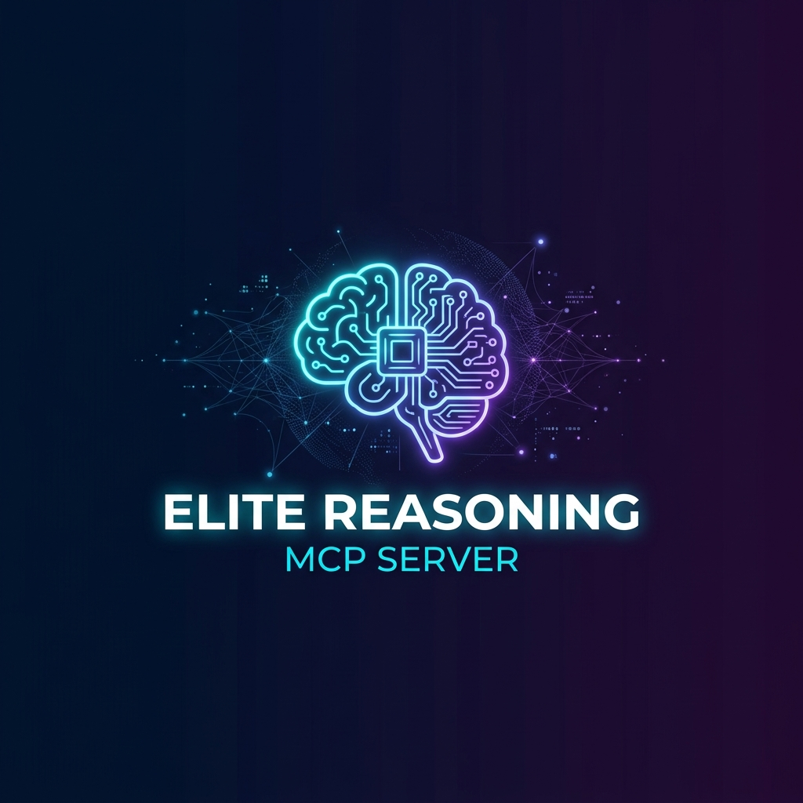

<p align="center">
  
</p>

<p align="center">
  <strong>Make any LLM think harder, reason better, and never repeat mistakes.</strong>
</p>

<p align="center">
  <a href="https://github.com/Snehgabani/elite-reasoning-mcp/actions/workflows/ci.yml"></a>
  <a href="https://pypi.org/project/elite-reasoning-mcp/"></a>
  <a href="https://pypi.org/project/elite-reasoning-mcp/"></a>
  <a href="https://pypi.org/project/elite-reasoning-mcp/"></a>
  <a href="LICENSE"></a>
  <a href="https://github.com/Snehgabani/elite-reasoning-mcp/stargazers"></a>
</p>

<p align="center">
  <a href="#-quick-start">Quick Start</a> •
  <a href="#-features">Features</a> •
  <a href="#%EF%B8%8F-architecture">Architecture</a> •
  <a href="#-73-tools">All Tools</a> •
  <a href="#-configuration">Config</a> •
  <a href="#-contributing">Contributing</a>
</p>

---

## Why Elite Reasoning?

Every AI coding assistant makes the **same mistakes twice**. Elite Reasoning fixes that.

It's an [MCP server](https://modelcontextprotocol.io/) that wraps around any LLM — GPT-4, Claude, Gemini, open-source — and adds a **persistent reasoning layer** with anti-pattern memory, decision tracking, confidence calibration, and self-improving prevention rules.

> **One install. Zero config. Works with Cursor, Antigravity, VS Code + Continue, Windsurf, and any MCP-compatible IDE.**

### The Problem

| Without Elite Reasoning | With Elite Reasoning |
|:---|:---|
| LLM forgets past mistakes | ✅ Anti-pattern memory prevents repeats |
| No confidence tracking | ✅ Brier-scored calibration per prediction |
| Generic responses | ✅ Intent-classified, complexity-scored routing |
| No decision audit trail | ✅ Every architectural decision logged + searchable |
| Manual quality checks | ✅ Automated pre-commit audits + FMEA risk gates |

---

## ⚡ Quick Start

### One-Line Install

```bash
pip install elite-reasoning-mcp
```

### Add to your IDE

**Antigravity / Gemini CLI** (`~/.gemini/config/mcp_config.json`):
```json
{
  "mcpServers": {
    "elite-reasoning": {
      "command": "elite-reasoning-mcp",
      "args": [],
      "env": {
        "ELITE_BRAIN_DIR": "~/.elite-reasoning/brain"
      }
    }
  }
}
```

**Cursor** (`.cursor/mcp.json`):
```json
{
  "mcpServers": {
    "elite-reasoning": {
      "command": "elite-reasoning-mcp",
      "env": {
        "ELITE_BRAIN_DIR": "~/.elite-reasoning/brain"
      }
    }
  }
}
```

**VS Code + Continue** (`~/.continue/config.yaml`):
```yaml
mcpServers:
  - name: elite-reasoning
    command: elite-reasoning-mcp
    env:
      ELITE_BRAIN_DIR: ~/.elite-reasoning/brain
```

### Activate the Pipeline

Add this to your IDE's system prompt (e.g., `~/.gemini/GEMINI.md` or Cursor Rules):

```markdown
## ⚡ RULE #0 — ELITE MCP PIPELINE

On EVERY user message, your FIRST tool call MUST be:

orchestrate_request_tool(user_prompt="<the user's exact message>")

No exceptions except "ok", "thanks", "yes", "no".
```

**That's it.** Restart your IDE and every conversation automatically benefits from the reasoning pipeline.

---

## 🚀 Features

### 🧠 Reasoning Pipeline
Every prompt flows through an intelligent routing system that classifies intent (13 categories), scores complexity (1-5), selects thinking mode, and checks anti-patterns — before your LLM even sees the task.

### 🛡️ Anti-Pattern Memory
Past mistakes are recorded with root-cause analysis and automatically surfaced when similar patterns appear. Your AI literally learns from its errors.

### 📊 Confidence Calibration
Track prediction accuracy with proper Brier scores. Know when your AI is overconfident vs. well-calibrated. Every prediction gets a confidence score and outcome tracking.

### ⚖️ Decision Council
Critical decisions get a 5-perspective adversarial review — optimist, pessimist, pragmatist, innovator, and devil's advocate — before committing.

### 🔒 Prevention Rules
Custom auto-triggered rules for your workflow. Define patterns that should trigger warnings, blocks, or automatic corrections. Rules self-improve through a learning pipeline.

### 📈 8-Layer Middleware Chain
Every tool call passes through telemetry → anti-pattern injection → prevention rules → cost tracking → usage logging → latency budgets → retry → fallback — with zero config.

### 🧪 Risk Analysis
FMEA (Failure Mode & Effects Analysis), Swiss Cheese audits, smoke test gates, and pre-mortem simulations — all built-in, all callable as MCP tools.

### 💾 Persistent Memory
Cross-session knowledge graph with temporal confidence decay, semantic search, and decision audit trails. Your AI remembers what it learned last week.

---

## 🏗️ Architecture

```
Your Prompt
    ↓
orchestrate_request_tool (FIRST tool call — fires on every message)
    ↓
┌──────────────────────────────────────────────┐
│  🎯 Intent Classifier    → 13 categories     │
│  📊 Complexity Scorer    → 1-5 scale         │
│  🧠 Thinking Mode        → convergent/div.   │
│  🛡️ Anti-Pattern Check   → Past mistake scan  │
│  ⚡ Prevention Engine    → Custom auto-rules  │
│  🔀 MCP/Skill Router    → Specialized tools   │
└──────────────────────────────────────────────┘
    ↓
Execution Plan (returned to LLM)
    ↓
LLM follows plan → Better output
    ↓
┌──────────────────────────────────────────────┐
│  8-Layer Middleware Chain (wraps every tool)  │
│  Telemetry → Injection → Prevention →        │
│  Cost → Usage → Latency → Retry → Fallback  │
└──────────────────────────────────────────────┘
    ↓
Results recorded → Learning loop improves next time
```

---

## 🔧 73 Tools

<details>
<summary><strong>Core Pipeline (3)</strong></summary>

| Tool | Description |
|:-----|:------------|
| `orchestrate_request_tool` | Master routing — fires on every prompt, classifies intent, routes to tools |
| `reasoning_preflight` | Pre-flight checklist for complex tasks |
| `assess_confidence` | Score confidence before committing to a plan |

</details>

<details>
<summary><strong>Quality & Anti-Patterns (6)</strong></summary>

| Tool | Description |
|:-----|:------------|
| `check_anti_patterns` | Semantic search over past mistakes |
| `record_mistake` | Log mistakes with root cause analysis |
| `record_quality_score` | Score output quality (1-10) |
| `get_quality_trend` | Track quality trends over time |
| `pre_commit_audit` | Audit code before delivering |
| `bias_scan` | Detect cognitive biases in reasoning |

</details>

<details>
<summary><strong>Decision Making (6)</strong></summary>

| Tool | Description |
|:-----|:------------|
| `record_decision` | Log architectural decisions with rationale |
| `search_decisions` | Query past decisions (FTS + semantic) |
| `decision_council_review` | 5-perspective adversarial review |
| `adopt_vs_build` | Build-or-adopt analysis framework |
| `socratic_challenge` | Challenge your own plan's assumptions |
| `after_action_review` | Post-mortem structured review |

</details>

<details>
<summary><strong>Risk Analysis (5)</strong></summary>

| Tool | Description |
|:-----|:------------|
| `fmea_analysis` | Failure Mode & Effects Analysis |
| `fmea_risk_gate` | Risk threshold gate (block if RPN too high) |
| `smoke_test_gate` | Pre-deploy smoke test |
| `swiss_cheese_audit` | Multi-layer safety audit (Reason model) |
| `simulate_future_regrets` | Pre-mortem / regret simulation |

</details>

<details>
<summary><strong>Confidence & Calibration (3)</strong></summary>

| Tool | Description |
|:-----|:------------|
| `calibration_predict` | Log predictions with confidence % |
| `calibration_resolve` | Record actual outcomes |
| `calibration_score` | Brier score accuracy report |

</details>

<details>
<summary><strong>Memory & Knowledge Graph (5)</strong></summary>

| Tool | Description |
|:-----|:------------|
| `ingest_context` | Store cross-session knowledge |
| `memory_search_context` | Semantic search over memory |
| `memory_sync_decisions` | Persist decisions to long-term memory |
| `memory_sync_mistakes` | Persist mistakes to memory |
| `query_temporal_graph` | Knowledge graph queries with time decay |

</details>

<details>
<summary><strong>Goals & Benchmarks (7)</strong></summary>

| Tool | Description |
|:-----|:------------|
| `set_goal` | Define goals with key results |
| `check_goals` | Review active goals |
| `update_goal` | Update goal progress |
| `archive_goal` / `delete_goal` | Lifecycle management |
| `benchmark_track` | Track performance benchmarks |
| `get_tool_usage_stats` | Tool usage analytics |

</details>

<details>
<summary><strong>Learning & Autonomy (12)</strong></summary>

| Tool | Description |
|:-----|:------------|
| `record_prompt_intent` | Track prompt patterns |
| `analyze_prompt_sequence` | Session analysis |
| `get_user_thinking_model` | Cognitive model of user patterns |
| `update_thinking_pattern` | Update learned patterns |
| `register_prevention_rule` | Create custom auto-rules |
| `list_prevention_rules` | View active rules |
| `predictive_prevention` | Predict failures before they happen |
| `autonomous_scan` | Self-improvement scan |
| `self_diagnose` | System health diagnostic |
| `get_autonomous_status` | Autonomy rate and gap report |
| `generate_autonomous_goals` | Auto-generate improvement goals |
| `record_missed_detection` | Log when the system should have caught something |

</details>

<details>
<summary><strong>Quantitative Reasoning (5)</strong></summary>

| Tool | Description |
|:-----|:------------|
| `bayesian_update` | Bayesian probability updates |
| `calculate_expected_value` | Expected value calculations |
| `compound_growth` | Compound growth modeling |
| `five_whys` | Root cause analysis (5 Whys) |
| `validate_predictions` | Validate prediction batches |

</details>

<details>
<summary><strong>Collaboration (5)</strong></summary>

| Tool | Description |
|:-----|:------------|
| `get_user_profile` | User preference profile |
| `update_user_config` | Update user settings |
| `list_team_users` | Team user management |
| `share_skill` | Share learned skills |
| `sync_team_memory` | Sync memory across team |

</details>

<details>
<summary><strong>Natural Language Verbs (6)</strong></summary>

| Tool | Description |
|:-----|:------------|
| `plan` | Create structured plans |
| `analyze` | Deep analysis mode |
| `audit` | Comprehensive audit |
| `predict` | Make tracked predictions |
| `learn` | Learn from outcomes |
| `introspect` | Self-reflection on reasoning |

</details>

<details>
<summary><strong>Hypothesis & Prospective (5)</strong></summary>

| Tool | Description |
|:-----|:------------|
| `record_hypothesis` | Log testable hypotheses |
| `resolve_hypothesis` | Record hypothesis outcomes |
| `record_prospective_failure` | Pre-register potential failures |
| `resolve_prospective_failure` | Record failure outcomes |
| `search_thinking_patterns` | Search learned patterns |

</details>

Plus **7 MCP Resources** (`elite://profile`, `elite://anti_patterns`, `elite://decisions`, `elite://quality`, `elite://health`, `elite://goals`, `elite://benchmarks`) for real-time dashboards.

---

## ⚙️ Configuration

### Environment Variables

| Variable | Default | Description |
|:---------|:--------|:------------|
| `ELITE_BRAIN_DIR` | `~/.elite-reasoning/brain` | Where to store persistent memory |
| `ELITE_ENABLE_LEGACY_INTERCEPTOR` | `0` | Enable legacy monkey-patch interceptor |
| `ELITE_GEMINI_BASE_URL` | (built-in) | Custom Gemini API endpoint |

### Development Setup

```bash
# Clone the repo
git clone https://github.com/Snehgabani/elite-reasoning-mcp.git
cd elite-reasoning-mcp

# Install with dev dependencies
uv sync --extra dev

# Run tests
uv run pytest tests/ -v

# Run linter
uv run ruff check core/ tests/

# Build package
uv build
```

---

## 🧪 Testing

```bash
# Run all tests (159 tests)
ELITE_BRAIN_DIR=/tmp/elite-test uv run pytest tests/ -v --tb=short

# Run with coverage
uv run pytest tests/ --cov=core --cov-report=html
```

The test suite covers:
- ✅ Persistent store (CRUD, FTS, graph, goals, benchmarks)
- ✅ Graph store (nodes, edges, temporal queries, hypotheses)
- ✅ Connection pooling and stale connection recovery
- ✅ FTS sanitization (injection prevention)

---

## 🤝 Contributing

Contributions are welcome! Here's how to get started:

1. **Fork** the repository
2. **Create** a feature branch (`git checkout -b feature/amazing-feature`)
3. **Run** the test suite (`uv run pytest tests/ -v`)
4. **Run** the linter (`uv run ruff check core/ tests/`)
5. **Commit** your changes (`git commit -m 'feat: add amazing feature'`)
6. **Push** to the branch (`git push origin feature/amazing-feature`)
7. **Open** a Pull Request

### Commit Convention

We use [Conventional Commits](https://www.conventionalcommits.org/):
- `feat:` — New features
- `fix:` — Bug fixes
- `chore:` — Maintenance
- `docs:` — Documentation

---

## 📄 License

MIT © [Sneh Gabani](https://github.com/Snehgabani)

---

<p align="center">
  <sub>Built with ❤️ for the AI-native developer workflow</sub>
</p>
<p align="center">
  <a href="https://github.com/Snehgabani/elite-reasoning-mcp/stargazers">⭐ Star us on GitHub</a> •
  <a href="https://pypi.org/project/elite-reasoning-mcp/">📦 View on PyPI</a> •
  <a href="https://github.com/Snehgabani/elite-reasoning-mcp/issues">🐛 Report a Bug</a>
</p>
