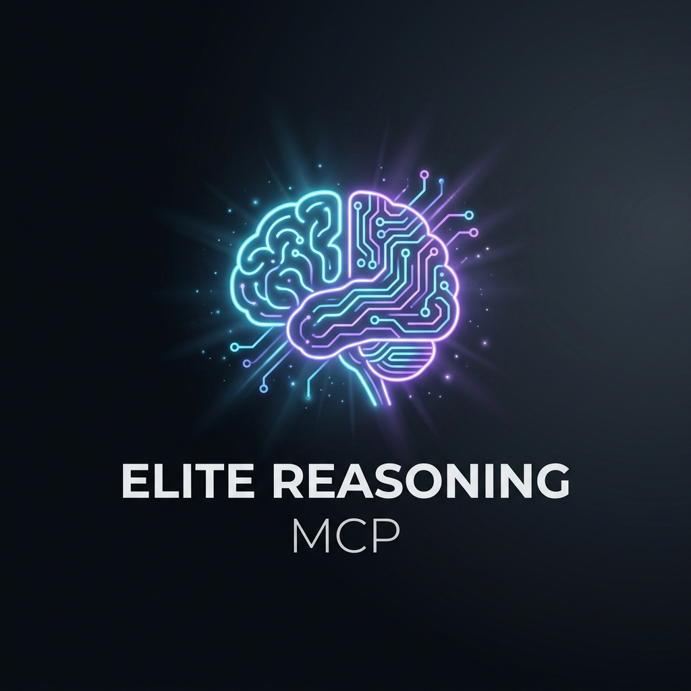

<div align="center">
  

  <h3>Make any LLM think harder, reason better, and never repeat mistakes.</h3>

  <p>
    <a href="https://opensource.org/licenses/MIT"></a>
    <a href="https://www.python.org/downloads/"></a>
    <a href="https://glama.ai/mcp/servers/Snehgabani/elite-reasoning-mcp"></a>
    <a href="https://github.com/Snehgabani/elite-reasoning-mcp/actions"></a>
    <a href="https://github.com/Snehgabani/elite-reasoning-mcp/stargazers"></a>
  </p>

  <p>
    <b>66 tools</b> · <b>Zero API costs</b> · <b>132KB</b> · <b>Works with any model</b>
  </p>

  <p>
    <a href="#quick-install">Install</a> ·
    <a href="docs/TOOLS.md">All 66 Tools</a> ·
    <a href="docs/ARCHITECTURE.md">Architecture</a> ·
    <a href="CONTRIBUTING.md">Contributing</a>
  </p>

  <br/>

  <!-- One-Click Install Buttons -->
  <a href="https://cursor.com/install-mcp?name=elite-reasoning&config=eyJjb21tYW5kIjoiYmFzaCIsImFyZ3MiOlsiLWMiLCJjZCB+Ly5lbGl0ZS1yZWFzb25pbmcgMj4vZGV2L251bGwgfHwgZ2l0IGNsb25lIGh0dHBzOi8vZ2l0aHViLmNvbS9TbmVoZ2FiYW5pL2VsaXRlLXJlYXNvbmluZy1tY3AuZ2l0IH4vLmVsaXRlLXJlYXNvbmluZyAmJiBjZCB+Ly5lbGl0ZS1yZWFzb25pbmcgJiYgdXYgcnVuIHB5dGhvbiAtbSBjb3JlLmludGVncmF0aW9uLm1jcF9zZXJ2ZXIiXX0="></a>
  &nbsp;&nbsp;
  <a href="https://insiders.vscode.dev/redirect?url=vscode-insiders%3A%2F%2Fanysphere.cursor-mcp%2Finstall%3Fconfig%3DeyJjb21tYW5kIjoiYmFzaCIsImFyZ3MiOlsiLWMiLCJjZCB+Ly5lbGl0ZS1yZWFzb25pbmcgMj4vZGV2L251bGwgfHwgZ2l0IGNsb25lIGh0dHBzOi8vZ2l0aHViLmNvbS9TbmVoZ2FiYW5pL2VsaXRlLXJlYXNvbmluZy1tY3AuZ2l0IH4vLmVsaXRlLXJlYXNvbmluZyAmJiBjZCB+Ly5lbGl0ZS1yZWFzb25pbmcgJiYgdXYgcnVuIHB5dGhvbiAtbSBjb3JlLmludGVncmF0aW9uLm1jcF9zZXJ2ZXIiXX0="></a>
</div>

<br/>

---

<br/>

## The Problem

AI coding assistants make the same mistakes over and over. They forget context between sessions. They don't stress-test their own reasoning. The quality of output varies wildly between prompts.

**Elite Reasoning MCP** intercepts every prompt and runs it through a reasoning pipeline — classifying intent, checking past mistakes, routing to the right tools, and tracking quality — before the LLM generates a single token.

<br/>

## How It Works

```
Your Prompt
    │
    ├── Intent Classifier      →  debug / build / design / deploy (13 types)
    ├── Complexity Scorer      →  1–5, adjusts reasoning depth
    ├── Anti-Pattern Checker   →  "You made this mistake before..."
    ├── Prevention Rules       →  Custom auto-triggered safeguards
    ├── MCP & Skill Router     →  Routes to the best available tools
    └── Pre-flight Checklist   →  Per-task reasoning steps
    │
    ▼
Execution Plan → LLM follows it → Better output
```

Everything runs locally. No API calls. No cloud. A single SQLite file stores anti-patterns, decisions, quality scores, and calibration data across sessions.

<br/>

## Quick Install

### macOS / Linux

```bash
git clone https://github.com/Snehgabani/elite-reasoning-mcp.git ~/.elite-reasoning
cd ~/.elite-reasoning && bash scripts/install.sh
```

### Windows (PowerShell)

```powershell
git clone https://github.com/Snehgabani/elite-reasoning-mcp.git $env:USERPROFILE\.elite-reasoning
cd $env:USERPROFILE\.elite-reasoning; .\scripts\install.ps1
```

### Docker

```bash
docker run -v elite-brain:/data/brain ghcr.io/snehgabani/elite-reasoning-mcp
```

> **Requirements:** Python 3.11+ and [uv](https://docs.astral.sh/uv/) (auto-installed by the installer).

<br/>

## What's Inside

### 66 Tools, 7 Categories

| Category | Tools | What They Do |
|----------|-------|-------------|
| **Core Pipeline** | `orchestrate_request_tool` `assess_confidence` `reasoning_preflight` | Intent classification, complexity scoring, pre-flight checklists |
| **Quality & Memory** | `record_mistake` `check_anti_patterns` `record_quality_score` `get_quality_trend` | Anti-pattern database, quality tracking, trend analysis |
| **Decision Making** | `decision_council_review` `record_decision` `search_decisions` | 5-perspective adversarial review, decision logging |
| **Risk Analysis** | `fmea_analysis` `swiss_cheese_audit` `smoke_test_gate` `bias_scan` | Failure mode analysis, defense layer audit, bias detection |
| **Calibration** | `calibration_predict` `calibration_resolve` `calibration_score` | Prediction tracking with Brier scores |
| **Learning** | `record_hypothesis` `five_whys` `after_action_review` `socratic_challenge` | Root cause analysis, hypothesis testing, self-challenge |
| **Autonomous** | `autonomous_scan` `self_diagnose` `predictive_prevention` | Self-monitoring, proactive issue detection |

> **Full reference:** [docs/TOOLS.md](docs/TOOLS.md)

<br/>

### Key Capabilities

<table>
<tr>
<td width="50%">

**Anti-Pattern Memory**

Stores every mistake with root cause and fix. The LLM checks this database before acting — so it never makes the same mistake twice.

</td>
<td width="50%">

**Decision Council**

Five adversarial perspectives review every major decision: Security, Scalability, Simplicity, User Impact, and Future Self.

</td>
</tr>
<tr>
<td width="50%">

**Confidence Calibration**

Tracks prediction accuracy with Brier scores. You learn when to trust the LLM's confidence — and when to doubt it.

</td>
<td width="50%">

**Cross-Session Memory**

Knowledge persists in a local SQLite database. Context compounds across conversations instead of resetting.

</td>
</tr>
<tr>
<td width="50%">

**FMEA Risk Analysis**

Failure Mode and Effects Analysis before you build. Catch what can go wrong before it does.

</td>
<td width="50%">

**Custom Prevention Rules**

Auto-triggered safeguards for your workflow. "Always check X before doing Y" — enforced automatically.

</td>
</tr>
</table>

<br/>

## IDE Support

Works with any MCP-compatible client via stdio transport:

| IDE | Config File |
|-----|------------|
| **Cursor** | `~/.cursor/mcp.json` |
| **Claude Desktop** | App Settings → MCP |
| **VS Code + Continue** | `.continue/config.json` |
| **Windsurf** | `~/.codeium/windsurf/mcp_config.json` |
| **Antigravity** | `~/.gemini/config/mcp_config.json` |

<details>
<summary><b>Manual Configuration</b></summary>

Add to your MCP config:

```json
{
  "mcpServers": {
    "elite-reasoning": {
      "command": "bash",
      "args": ["-c", "cd ~/.elite-reasoning && uv run python -m core.integration.mcp_server"]
    }
  }
}
```

On Windows, use `scripts/run_elite_mcp.bat` instead:

```json
{
  "mcpServers": {
    "elite-reasoning": {
      "command": "cmd",
      "args": ["/c", "%USERPROFILE%\\.elite-reasoning\\scripts\\run_elite_mcp.bat"]
    }
  }
}
```

</details>

<br/>

## Architecture

```
elite-reasoning-mcp/
├── core/
│   ├── integration/
│   │   └── mcp_server.py          # FastMCP server, tool registration
│   ├── memory/
│   │   ├── persistent_store.py    # SQLite — 15 tables, 32 indexes
│   │   ├── graph_store.py         # Knowledge graph
│   │   └── embedding.py           # Semantic search (optional)
│   ├── tools/
│   │   ├── orchestration.py       # Intent classification & routing
│   │   ├── reasoning_amplifier.py # Calibration, council, preflight
│   │   ├── adaptive.py            # Learning & user modeling
│   │   ├── analysis.py            # Risk, FMEA, confidence
│   │   ├── auditing.py            # Quality & anti-patterns
│   │   └── planning.py            # Goals & benchmarks
│   └── identity/
│       └── user_profile.py        # Per-user configuration
├── schemas/                       # 66 JSON tool schemas
├── scripts/                       # Installers & launchers
└── Dockerfile                     # Container support
```

> **Full architecture docs:** [docs/ARCHITECTURE.md](docs/ARCHITECTURE.md)

<br/>

## Performance

| Metric | Value |
|--------|-------|
| Package size | 132KB |
| Startup time | < 2s |
| Per-tool latency | < 50ms |
| Storage | Local SQLite |
| API costs | $0 |
| Network calls | Zero |

<br/>

## FAQ

<details>
<summary><b>Does this work with weak / open-source models?</b></summary>
<br/>
Yes. The pipeline runs before the model generates output, so even weaker models get structured reasoning plans, anti-pattern checks, and quality tracking. The tools amplify whatever model you're using.
</details>

<details>
<summary><b>Will it slow down my responses?</b></summary>
<br/>
No. Each tool call takes < 50ms. The orchestrator adds one tool call per prompt. Total overhead is negligible.
</details>

<details>
<summary><b>How is this different from sequential-thinking?</b></summary>
<br/>
Sequential-thinking gives the LLM a scratchpad for multi-step reasoning. Elite Reasoning MCP goes further: it classifies intent, checks past mistakes, routes to specialized tools, tracks quality over time, and builds persistent memory across sessions. They're complementary — use both.
</details>

<details>
<summary><b>Is my data private?</b></summary>
<br/>
100%. Everything runs locally. The SQLite database is on your machine. No telemetry, no API calls, no cloud. Your code and prompts never leave your computer.
</details>

<br/>

## Contributing

We welcome contributions. See [CONTRIBUTING.md](CONTRIBUTING.md) for guidelines.

**Good first issues:**
- Add new reasoning tools
- Improve the intent classifier
- Write tests
- Add benchmarks for output quality with/without the pipeline

<br/>

## Security

All data stays local. Zero network calls. No telemetry. See [SECURITY.md](SECURITY.md) for the full policy.

Found a vulnerability? Email [snehgabani@users.noreply.github.com](mailto:snehgabani@users.noreply.github.com) — don't open a public issue.

<br/>

## License

[MIT](LICENSE) — use it however you want.

<br/>

---

<div align="center">
  <p>
    <sub>Built by <a href="https://github.com/Snehgabani">@Snehgabani</a></sub>
  </p>
  <p>
    <a href="https://github.com/Snehgabani/elite-reasoning-mcp">
      
    </a>
  </p>
</div>
